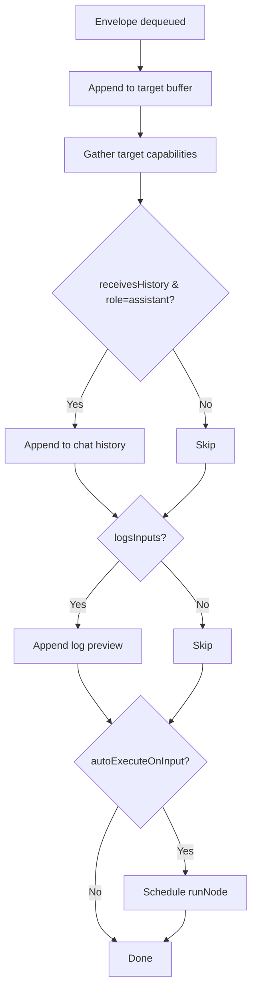
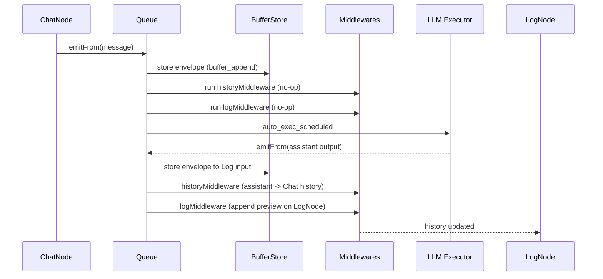
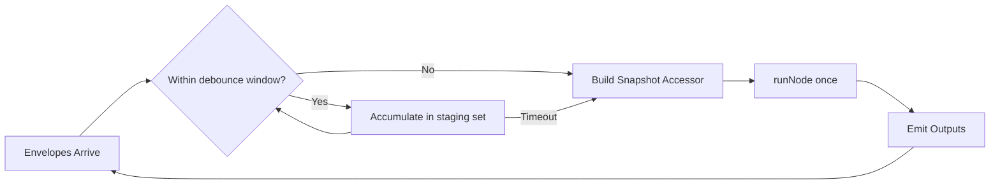

# Execution v2: Queue + Middleware Architecture

This document explains the new execution pipeline introduced in the PBI-32 refactor. It replaces ad‑hoc recursive propagation and node‑type conditional logic with a capability & middleware driven model.

## Goals
- Decouple propagation mechanics from node-specific behavior
- Provide consistent buffering semantics per (node, port)
- Enable diagnostics & extensibility (future batching, persistence, streaming)
- Preserve legacy behavior during transition (backward buffer + new envelopes)

## Core Concepts
### EmissionEnvelope
A normalized record of a value moving from one node's output port to a target node's input port:
```
{id, fromNodeId, fromPort, toNodeId, toPort, value, ts, meta?}
```
`meta.role = 'assistant'` marks assistant-originated messages (e.g. from LLM) used by history middleware.

### Capability Registry
Each node type registers a `NodeCapabilities` object:
```
{
  type: 'LLM',
  assistantEmitter: true,
  autoExecuteOnInput: true,
  receivesHistory?: boolean,
  logsInputs?: boolean,
  maxInputBuffer?: number
}
```
Capabilities let the engine decide behaviors without scattering `if(node.type===...)` checks.

### Input Buffer Store
`InMemoryInputBufferStore` keeps per-port rolling windows of envelopes.
Key methods:
- `append(port, env)`
- `getLatest(port)`
- `window(port, n)` (last n entries)
- `since(port, ts)` (entries after timestamp)
- `reduce(port, fn, init)`

Currently stores are per-target-node (created lazily); future work may move to a shared persistence layer.

### Middlewares
Pure functions that observe an incoming envelope and (optionally) mutate node props via provided callbacks:
- `historyMiddleware` – Appends assistant messages to chat history when `receivesHistory` capability is set.
- `logMiddleware` – Appends a classified preview entry to a node's `history` when `logsInputs` is set (LogNode).

They return diagnostics objects describing side effects (e.g. `history_appended`). Additional middlewares can be composed without changing core propagation logic.

### Queue Orchestrator
Instead of depth-first recursive calls, emissions are enqueued and drained in FIFO order:
1. Source node calls `emitFrom(nodeId, port, value)`
2. For each outgoing edge a new `EmissionEnvelope` is created and enqueued with processing options.
3. `drainQueue()` processes each item:
   - Append to target buffer (`buffer_append` diagnostic)
   - Run middlewares (history, log)
   - Decide auto-execution if `autoExecuteOnInput`
4. If auto-exec is triggered, `runNode()` is invoked and its emissions recursively feed back into the enqueue path.

This BFS-like approach avoids deep recursion and provides a natural insertion point for batching, prioritization, backpressure, or async scheduling.

### Legacy Compatibility Layer
While the new buffer store records envelopes, the legacy `inputBuffers` structure is still updated for existing executors/tests expecting the old shape. This will be phased out after all executors consume the new accessor abstraction.

## Diagnostics Events (Current)
- `buffer_append` – Envelope stored
- `history_appended` – Chat history updated
- `log_appended` – Log entry added
- `auto_exec_scheduled` – Node scheduled for execution (LLM)

Planned additions: `batch_started`, `batch_flushed`, `input_evicted`, `executor_error`.

## Execution Flow Example (Chat → LLM → Log)
1. User emits `message` from ChatNode → envelopes created for downstream LLM.
2. Queue drains: LLM buffer updated; auto-exec fires (`auto_exec_scheduled`).
3. LLM executor produces assistant output → `emitFrom` called with `output`.
4. Envelope to LogNode processed; log middleware appends preview entry.
5. UI reflects updated LogNode history after node props persist.

## Extensibility Points
| Layer | How to Extend | Example |
|-------|---------------|---------|
| Capabilities | Register new flags or custom bag | `{ custom: { stream: true } }` |
| Middlewares | Add new file under `execution/middlewares` & export | Metrics collector |
| Queue Policy | Replace FIFO with priority structure | Real-time vs background cmds |
| Buffer Store | Swap `InMemoryInputBufferStore` with persistent or sharded impl | Redis / IndexedDB |
| Diagnostics | Push events to an observer | DevTools timeline panel |

## Batching (Future Slice)
Current behavior executes per-envelope when `autoExecuteOnInput` is true. Planned evolution:
- Collect envelopes for a node within a short debounce window
- Produce a snapshot input accessor referencing a consistent cut of buffers
- Execute once per trigger group

## Migration Plan Snapshot
| Phase | Action | Status |
|-------|--------|--------|
| 1 | Types + capabilities | ✅ |
| 2 | Buffer store + tests | ✅ |
| 3 | Middlewares (history, log) | ✅ |
| 4 | Queue + processEmission | ✅ |
| 5 | Replace conditional logic in `emitFrom` | ✅ |
| 6 | Docs & diagnostics surfacing | (this doc) |
| 7 | Integrate accessor into all executors | Pending |
| 8 | Remove legacy inputBuffers | Pending |
| 9 | Add batching + persistence | Planned |

## Phase 7: Variable Mapping Extraction (LLM)

Previously, the LLM executor performed implicit variable discovery, cold pulls (file contents, last chat message, recent log previews), and dynamic `inputVars` augmentation inline. This created a large, monolithic executor block and forced any evolution (e.g. batching or alternative providers) to re‑touch core logic.

Phase 7 extracts this concern into a dedicated helper: `buildVarMappings()` (`execution/varMapping.ts`).

### Goals
- Isolate cold pull & implicit var inference logic
- Provide deterministic, testable surface returning `{ latestMap, inputVars, diagnostics }`
- Preserve existing behavior & diagnostics without leaking graph scan details into executor
- Prepare for future: caching, async fetch parallelism, schema‑derived var semantics

### Helper Contract
```
buildVarMappings({
  nodeId,          // target LLM node
  template,        // prompt template to detect referenced vars
  latestMap,       // mutable map (enriched with cold pulls)
  inputVars,       // existing explicit mappings (augmented in place)
  autoDerive       // governs whether unreferenced resources are pulled
}) => {
  latestMap,       // same reference, enriched
  inputVars,       // augmented with implicit { port, var, kind:'auto' }
  diagnostics      // structured events mirroring legacy inline messages
}
```

### Cold Pull Rules (unchanged behavior)
- FileReaderNode: loads metadata and optionally content (`emitContent`) if autoDerive or template references the variable.
- ChatNode: captures last user message as `{ role:'user', content }`.
- LogNode: captures up to 5 recent previews.
- Generic: JSON summary of props (capped length).
- Skips unreferenced file data when `autoDerive=false` and template lacks `{var}` placeholder.

### Benefits
- Executor body slimmed → easier to reason about provider selection & prompt rendering.
- Dedicated unit tests (`varMapping.test.ts`) validate inclusion and skip scenarios.
- Diagnostics preserved (`cold_pull_*`, `implicit_var_mapping_added`, `inputVar_edge_scan_failed`).

### Next Enhancements (Future)
- Cache cold pull results per runId / change hash.
- Support streaming var population (progressive context building).
- Schema `x-capabilities.vars` to predeclare pull strategies without graph scan.


## Minimal API Reference
```
// capabilityRegistry.ts
capabilityRegistry.get(type)
capabilityRegistry.register(caps)

// queue.ts
createEnvelope(partial)
enqueueEmission(env, opts)
drainQueue(autoExecHandler)
processEmission(env, opts)

// bufferStore.ts
store.append(port, env)
store.getLatest(port)
store.window(port, n)
store.since(port, ts)
store.reduce(port, fn, init)
```

## Adding a New Middleware
1. Create `execution/middlewares/yourMiddleware.ts`
2. Export a function `(env, caps, ctx) => MiddlewareResult | void`
3. Add import & invocation in `queue.ts` (or introduce a dynamic registry if count grows)

## Testing Guidelines
- Unit test buffer behaviors (eviction, window, since)
- Scenario test multi-input + trigger semantics
- Integration test pipelines (Chat → LLM → Log)
- Guard schema parity when adding new capability-related schema metadata

## Open Questions
- Where should diagnostics events be surfaced (UI panel? log file?)
- Do we formalize an execution timeline artifact for replay?
- Should capability metadata derive from schemas (`x-capabilities`)?

## Glossary
- Envelope: Discrete emission data structure
- Auto-exec: Automatic executor run triggered by new input
- Snapshot: Consistent set of buffered inputs used by a single run

---
Feedback welcome. Iterate before persisting external docs.

## Diagrams

### 1. High-Level Architecture
```mermaid
flowchart LR
  subgraph Source[Source Node]
    SOUT[emitFrom()]
  end

  SOUT -->|createEnvelope| Q[Emission Queue]
  Q -->|dequeue| PROC[processEmission]

  subgraph PROC_GROUP[processEmission]
    PROC --> BUF[Input Buffer Store]
    PROC --> MWS[Middlewares]
    MWS --> HISTMW[historyMiddleware]
    MWS --> LOGMW[logMiddleware]
    LOGMW --> LOGUTIL[appendLogEntry]
    HISTMW -->|history_appended| CAPSDECISION{autoExecuteOnInput?}
    LOGMW -->|log_appended| CAPSDECISION
    BUF -->|buffer_append| CAPSDECISION
  end

  CAPSDECISION -->|Yes| EXEC[runNode Executor]
  CAPSDECISION -->|No| END[(Drain Next)]
  EXEC -->|emits envelopes| Q

  subgraph Capabilities
    CAPS[Capability Registry]
  end

  CAPS -. lookup .-> PROC
```

### 2. Envelope Processing Decision Flow


### 3. Chat → LLM → Log Sequence


### 4. Future Batching Concept (Planned)


These diagrams are intentionally platform-neutral; they omit UI update mechanics and persistence layers still under design.
